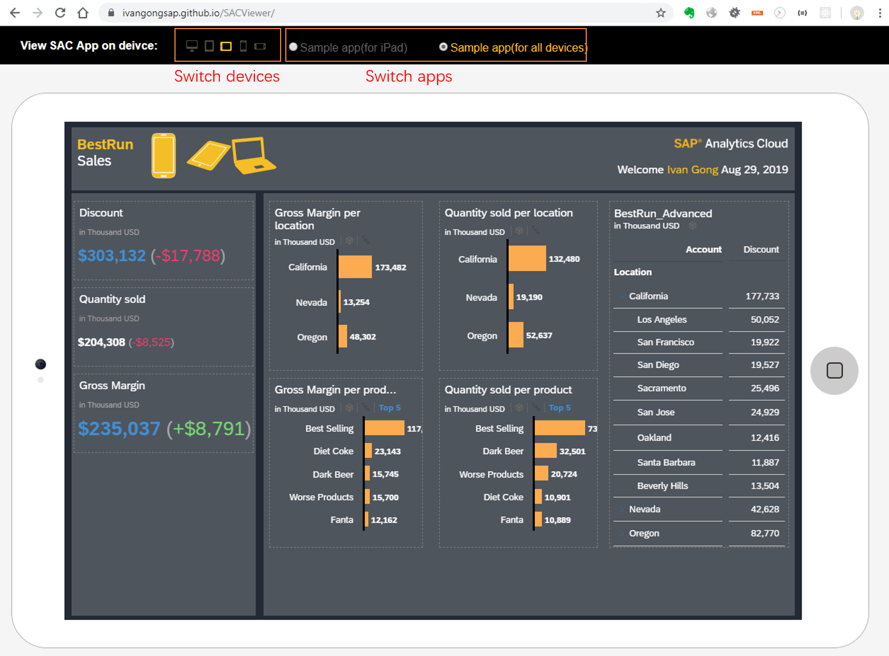

# SACViewer

#### SAC Viewer is a device simulator web application that view the SAC apps on different device.



## How to run?
There are two SAC apps embed by default. Following below two steps to run the demo.

Step 1: Open [https://master-toggle-app-design.eu2cnry.projectorca.cloud/](https://master-toggle-app-design.eu2cnry.projectorca.cloud/) with google Chrome browser and login with your credential successfully.

Step 2: Open [https://ivangongsap.github.io/SACViewer/](https://ivangongsap.github.io/SACViewer/) and one SAC app is loaded by default. Then you can switch different devices to view the SAC app.


## How to add your own SAC app?

In the file [https://github.com/IvanGongSap/SACViewer/blob/master/index.html](https://github.com/IvanGongSap/SACViewer/blob/master/index.html), add below code.

```bash
<li class="apps">
  <input name="app" type="radio" value="https://master-toggle-app-design.eu2cnry.projectorca.cloud/sap/fpa/ui/tenants/fd23e/app.html#;mode=embed;view_id=appBuilding;appId=FECB22ED1DF51D84E1D7C03B8E5E69EB" />
  <label>Sample app(for iPad) </label>
</li>
```
(Note: Please use parameter `mode=embed` in the url.)


## Questions?

Contact Ivan Gong [ivan.gong@sap.com].
